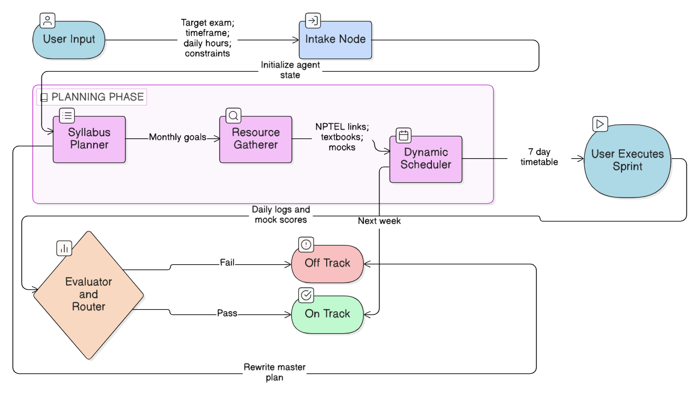
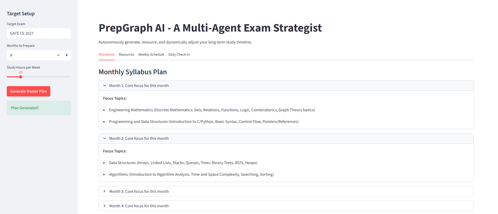
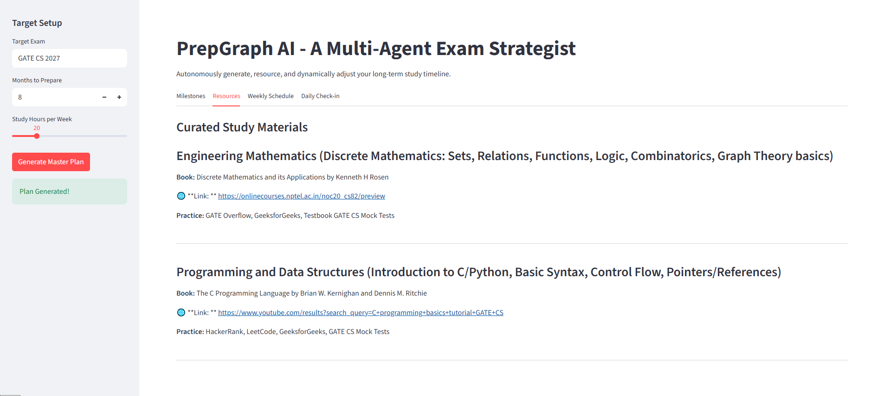
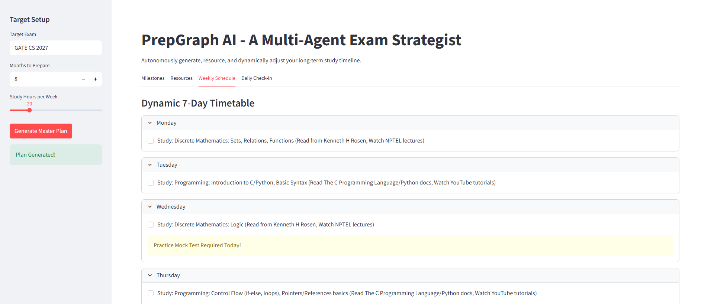
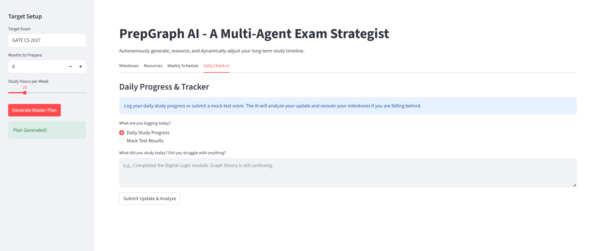

#  PrepGraph AI - Multi-Agent Exam Strategist

**An autonomous, LangGraph-powered state machine designed to generate, resource, and dynamically reroute long-term study plans for massive competitive exams.**


| A generative multi-agent system built for GATE, GRE, and UPSC aspirants.

---

##  Overview

Unlike static calendar generators, PrepGraph utilizes a multi-agent feedback loop. It generates actionable 7-day sprints and actively rewrites future monthly milestones based on the user's weekly mock-test performance, ensuring the study plan adapts to weak areas in real-time.

---

##  Table of Contents

- [Features](#-features)
- [Architecture & Workflow](#%EF%B8%8F-architecture--workflow)
- [Tech Stack](#-tech-stack)
- [Screenshots](#-screenshots)
- [Prerequisites](#-prerequisites)
- [Installation & Setup](#-installation--setup)
- [Author](#-author)

---

##  Features

* **Multi-Agent Orchestration:** Four distinct AI agents handle intake, syllabus chunking, resource gathering, and dynamic scheduling.
* **RAG & Tool Calling:** Integrates the Tavily Search API to autonomously scrape the web for specific, real-time study materials, NPTEL lectures, and textbooks, preventing LLM link hallucination.
* **Dynamic Feedback Loop (Conditional Routing):** Features an Evaluator Agent that grades weekly updates. If a user fails a mock test, a Router Agent intercepts the workflow to inject targeted revision blocks into upcoming months without breaking the overall timeline.
* **Long-Term Memory:** Implements LangGraph's `MemorySaver` to persist the graph state (`thread_id`) across sessions, allowing users to return weeks later to update their progress.
* **Strict State Management:** Enforces Pydantic schemas across all node outputs to ensure rigid, predictable data flow through the state machine.

---

##  Architecture & Workflow

The application acts as a directed cyclic graph. Information flows through the `AgentState` payload, updated sequentially by the nodes.

1. **Intake Node:** Extracts target exam, timeframe, and user constraints.
2. **Syllabus Planner (Agent 1):** Chunks the massive raw syllabus into logical, prerequisite-first monthly milestones.
3. **Resource Gatherer (Agent 2):** Uses Tavily Web Search to map milestones to real-world URLs, books, and practice platforms.
4. **Dynamic Scheduler (Agent 3):** Generates a rigid, actionable 7-day timetable based on the immediate upcoming topics.
5. **Evaluator & Router (Agent 4 - Feedback Loop):** Takes user mock-test scores. If off-track, triggers conditional edges to rewrite the master syllabus before generating the next 7-day schedule.

 

---

##  Tech Stack

* **Framework:** LangChain, LangGraph
* **LLM:** Google Gemini (`gemini-2.5-flash`) via `ChatGoogleGenerativeAI`
* **Data Validation:** Pydantic
* **UI:** Streamlit
* **Search:** Tavily Search API

---

##  Screenshots


### 1. Monthly Milestones Generator
> *AI-generated logical breakdown of the massive syllabus into prerequisite-first monthly chunks.*
> 


### 2. Autonomous Resource Gatherer
> *Mapping of syllabus topics to exact NPTEL lectures, recommended textbooks, and practice platforms using Tavily Search.*
> 


### 3. Dynamic 7-Day Timetable
> *Actionable weekly sprints generated based on the immediate upcoming milestones, including mock test reminders.*
> 


### 4. Progress & Feedback Tracker
> *Daily logs and mock test inputs that trigger the Evaluator Agent to reroute the master plan if the user is falling behind.*
> 


---

##  Prerequisites

Before setting up PrepGraph, ensure you have the following installed:

* **Python** `v3.9` or higher
* **Git**
* Active API keys for Google Gemini and Tavily Search

---

##  Installation & Setup

Run the following commands in your terminal to completely set up the application on your local machine and launch the server.

### 1. Clone the repository
```bash
git clone https://github.com/Taqreem-k/PrepGraph-AI.git
```

### 2. Navigate into the project directory
```bash
cd 'PrepGraph-AI'
```

### 3. Create a virtual environment
```bash
python -m venv venv
```

### 4. Activate the virtual environment
**On Windows:**
```bash
venv\Scripts\activate
```
**On macOS/Linux:**
```bash
source venv/bin/activate
```

### 5. Install all project dependencies
```bash
pip install -r requirements.txt
```

### 6. Set up environment variables
```bash
cp .env.example .env
```
*(Required: Open the `.env` file and add your specific API keys before proceeding)*

### 7. Start the application
```bash
streamlit run app.py
```

---

##  Author

**Mohammad Taqreem Khan**